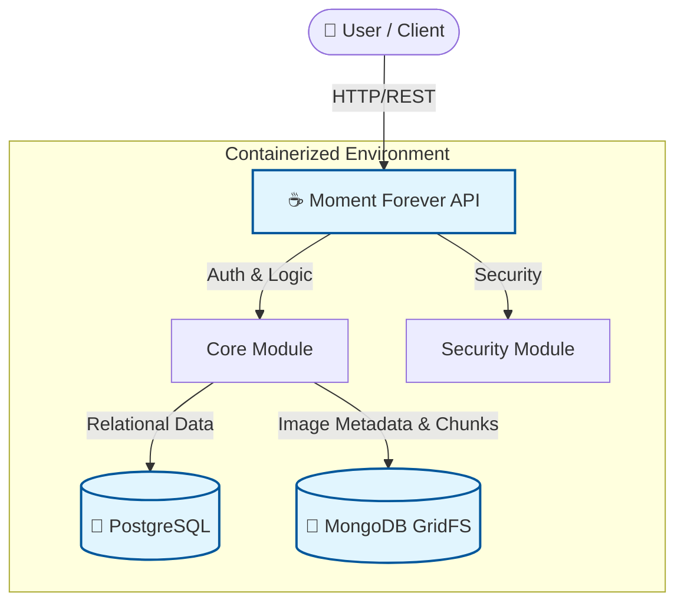

# 🌟 Moment Forever Application
> **"Preserving Your Special Moments, Forever."**

[](https://www.oracle.com/java/technologies/javase/jdk17-archive-downloads.html)
[](https://spring.io/projects/spring-boot)
[](https://www.postgresql.org/)
[](https://www.mongodb.com/)
[](https://www.docker.com/)

---

## 📖 About
**Moment Forever** is a premier event decoration platform designed to make every celebration unforgettable. From intimate gatherings to grand weddings, we provide a seamless experience to discover, customize, and book decoration services.

### Key Features
*   **🎉 Event Discovery**: Browse categories and sub-categories of decoration styles.
*   **🔐 Secure Authentication**: JWT-based security with role-based access (User, Admin, Super Admin).
*   **🖼️ Media Management**: High-performance image storage using MongoDB GridFS.
*   **⚡ Modern Architecture**: Micro-modular monolith design built on Spring Boot.

---

## 🏗️ Architecture
The application follows a modular architecture, orchestrating relational data and file storage seamlessly.



---

## 🚀 Getting Started (Docker)
The easiest way to run the application is using Docker. This will set up the App, PostgreSQL, and MongoDB automatically.

### Prerequisites
*   [Docker Desktop](https://www.docker.com/products/docker-desktop/) installed and running.

### 1️⃣ Run the Application
Open your terminal in the project root and run:

```bash
docker-compose up --build
```
> *Wait for the logs to show "Started MomentForeverApp".*

### 2️⃣ Access the Application
*   **API Documentation**: [http://localhost:8080/swagger-ui.html](http://localhost:8080/swagger-ui.html)
*   **API Base URL**: `http://localhost:8080`

---

## 🛠️ Getting Started (Manual)
If you prefer running without Docker, follow these steps.

### Prerequisites
*   JDK 17
*   Maven 3.8+
*   PostgreSQL (Running on port 5432)
*   MongoDB (Running on port 27017)

### 1️⃣ Configure Database
Ensure your local `postgres` user has password `groote` and database `moment_forever_db` exists, or update `src/main/resources/application.yml`.

### 2️⃣ Build and Run
```bash
mvn clean compile
mvn spring-boot:run
```

---

## 📚 API Documentation
We use **Swagger UI** for interactive API exploration.

| Group | Description | URL |
| :--- | :--- | :--- |
| **Public API** | Registration, Login, Browsing | `/v3/api-docs/1-public` |
| **User API** | Profile Management | `/v3/api-docs/2-user` |
| **Admin API** | Role, specific User Management | `/v3/api-docs/3-admin` |

---

## 🤝 Contribution
1.  Fork the repository
2.  Create your feature branch (`git checkout -b feature/AmazingFeature`)
3.  Commit your changes (`git commit -m 'Add some AmazingFeature'`)
4.  Push to the branch (`git push origin feature/AmazingFeature`)
5.  Open a Pull Request

---
*Built with ❤️ by the Moment Forever Team*
